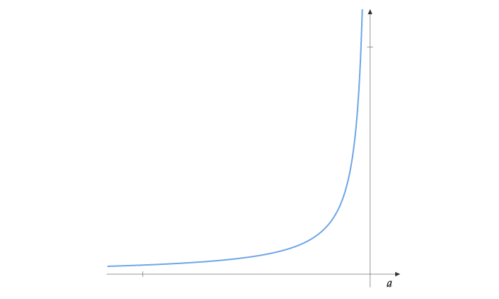

This post is about "Potential Functions" in the context of Online Learning. These form the basis for the Implicitly Normalized Forecaster(INF) studied in [1,2]. We present some basic results about potential functions here.

A function $$\psi: (-\infty,a) \to (0,+\infty)$$ for some $$a \in  \mathbb{R} \cup \{+\infty\}$$ is called a potential if it is convex, continuously differentiable and satisfies:

$$
\begin{align*}
\lim_{x \to -\infty} \psi(x) =  0 \quad &&\quad  \lim_{x \to a} \psi(x) = +\infty\\
\psi' >0 \quad && \quad \int_{0}^{1} |\psi^{-1} (s)| ds < + \infty
\end{align*}  
$$

For instance, $$\exp(x)$$ is a potential function with $$a=\infty$$ and $$-1/x$$ is a potential with $$a=0$$. A potential function usually looks like this:

Consider a function $$g: \mathbb{R}^n \times \mathbb{R} \to \mathbb{R}_+$$ defined as

$$
g(y,\lambda) = \sum_{i=1}^n \psi(y_i + \lambda)
$$

**Lemma 1:** For every $$y \in \mathbb{R}^n$$, there exists a unique $$\lambda$$ such that $$y_i + \lambda < a$$ for all $$i$$ and $$g(y, \lambda)=1$$
**Proof:**
For every $$y \in \mathbb{R}^n$$, we have that $$\lim_{\lambda \to -\infty} g(y,\lambda) = 0$$ and $$\lim_{\lambda \to a-\min_i(y_i)} g(y,\lambda) = +\infty$$. As $$g$$ is monotonically increasing and continuous, by the intermediate value theorem, for every $$y \in \mathbb{R}^n$$ there exists a unique $$\lambda$$ such that $$g(y, \lambda)=1$$.

Using Lemma 1, we can define a function $$\lambda(y)$$ such that:

$$
g(y,\lambda(y)) = \sum_{i=1}^n \psi(y_i + \lambda(y))=1
$$

 Q.E.D 

Since $$\psi(y_i + \lambda(y)) \geq 0$$ and $$\sum_{i=1}^n \psi(y_i + \lambda(y))=1$$, we can see that $$P(y) = \{\psi(y_i + \lambda(y))\}_{i=1}^n$$ forms a probability distribution.

These probability distributions defined through $$\psi$$ come up in online learning algorithms such as OMD and FTRL when the decision space is the probability simplex. A generalized Implicitly Normalized Forecaster(INF) algorithm can be written as:

**Generalized INF**
Given a potential $$\psi$$ and "Loss Aggregators" $$h_1,h_2,\dots,h_T$$
1. Let $$\theta_0 = 0$$
2. For $$t=1 \dots T:$$
   1. Play the point $$x_t = P(\theta_{t-1})$$
   2. Observe the loss function $$l_t(x)$$
   3. Compute $$\theta_t = h_t(l_1,\dots,l_t)$$

The loss aggregators collect the losses seen so far and output a vector, using which we compute the point to play.

Considering linear losses, the aggregators for time varying OMD are given by:

$$h_t(l_1,\dots,l_t) = - \sum_{s=1}^t \eta_s l_s$$

The aggregators for time varying FTRL are given by:

$$h_t(l_1,\dots,l_t) = - \eta_t \sum_{s=1}^t  l_s$$

We will treat OMD and FTRL in future posts. In the remaining post, we present some properties of potential functions.

#### Constant Translation
**Lemma 2:** Let $$y, y' \in \mathbb{R}^n$$.  If $$y'_i = y_i + c$$ for all $$i$$, then $$\lambda(y') = \lambda(y)-c$$.
**Proof:**
Observe that

$$
g(y, c+\lambda(y')) =\sum_{i=1}^n \psi(y_i +c + \lambda(y')) = \sum_{i=1}^n \psi(y'_i + \lambda(y')) = g(y',\lambda(y'))=  1
$$

Since $$\lambda(y)$$ is the unique solution to $$g(y,\lambda)=1$$, we must have that $$\lambda(y) = c + \lambda(y')$$.

 Q.E.D 

#### Associated Function
Associated with a potential $$\psi$$, we define a function $$f:(0,+\infty) \to \mathbb{R}$$ as

$$
f(z) = \int_{0}^z \psi^{-1}(s) ds
$$

Observe that $$f'(z) = \psi^{-1}(z)$$  and $$f'(z) = \left[ \psi'(\psi^{-1}(z))\right]^{-1}$$. So $$\lim_{z \to 0}|\psi^{-1}(z)| = +\infty$$ and $$f$$ is strictly convex, proving that $$f$$ is a Legendre function on $$(0,\infty)$$. The Legendre-Fenchel dual of $$f$$ is $$f^\star:(-\infty,a) \to  \mathbb{R}$$ defined as $$f^\star(u) = \sup_{z > 0} zu - f(z)$$, which by definition of $$f$$ is same as:

$$
f^\star(u) = u \psi(u) - f(\psi(u))
$$

The following relations hold:

$$
\begin{align*}
f'(z) = \psi^{-1}(z) \quad && \quad {f^\star}'(u) = \psi(u) \\
f''(z) = \left[ \psi'(\psi^{-1}(z))\right]^{-1} \quad && \quad {f^\star}''(u) = \psi'(u)
\end{align*}
$$

The INF algorithm using potential $$\psi$$ along with suitable aggregators will be equivalent to OMD/FTRL on the simplex with regularizer $$F(x) = \sum_{i=1}^n f(x_i)$$.

#### Concavity of $$\lambda(y)$$
Taking the gradient of $$\sum_{i=1}^n \psi(y_i + \lambda(y))=1$$, we have:

$$
\begin{align*}
&\sum_{i=1}^n \psi'(y_i+\lambda(y))(e_i + \nabla \lambda(y))=0\\
\implies & \nabla \lambda(y) = - \frac{ \sum_{i=1}^n \psi'(y_i+\lambda(y)) e_i}{\sum_{i=1}^n \psi'(y_i+\lambda(y))}
\end{align*}
$$

$$\nabla \lambda(y)$$ is the vector $$\{- \frac{  \psi'(y_i+\lambda(y)) }{\sum_{i=1}^n \psi'(y_i+\lambda(y))}\}_{i=1}^n$$.

Taking the gradient of $$\sum_{i=1}^n \psi'(y_i+\lambda(y))(e_i + \nabla \lambda(y))=0$$, we have:

$$\begin{align*}
&\sum_{i=1}^n \psi''(y_i+\lambda(y))(e_i + \nabla \lambda(y))^{\otimes 2} + \nabla^2 \lambda(y) \left(\sum_{i=1}^n \psi'(y_i+\lambda(y)) \right)=0\\
\implies & \nabla^2 \lambda(y) = - \frac{ \sum_{i=1}^n \psi''(y_i+\lambda(y))(e_i + \nabla \lambda(y))^{\otimes 2} }{\sum_{i=1}^n \psi'(y_i+\lambda(y))}
\end{align*}$$

The above Hessian is negative definite, so $$\lambda(y)$$ is strictly concave.

#### Convexity of $$D(y)$$
Define the function:

$$D(y) = -\lambda(y) + \sum_{i=1}^n f^\star(y_i + \lambda(y))$$

The gradient of $$D$$ is:

$$\begin{align*}
\nabla D(y) &= - \nabla \lambda(y) + \sum_{i=1}^n \psi(y_i + \lambda(y))(e_i + \nabla \lambda(y))\\
&= - \nabla \lambda(y) +\nabla \lambda(y) + \sum_{i=1}^n \psi(y_i + \lambda(y))e_i\\
&= P(y)
\end{align*}
$$

The Hessian of $$D$$ is:

$$\begin{align*}
\nabla^2 D(y) &= - \nabla^2 \lambda(y) + \sum_{i=1}^n \psi'(y_i + \lambda(y))(e_i + \nabla \lambda(y))^{\otimes 2} + \sum_{i=1}^n \psi(y_i+\lambda(y)) \nabla^2 \lambda(y)\\
&= \sum_{i=1}^n \psi'(y_i + \lambda(y))(e_i + \nabla \lambda(y))^{\otimes 2}
\end{align*}
$$

So $$D(y)$$ is strictly convex.

### Refernces
[1] Audibert, J. Y., Bubeck, S., & Lugosi, G. (2011, December). Minimax policies for combinatorial prediction games. In Proceedings of the 24th Annual Conference on Learning Theory (pp. 107-132). JMLR Workshop and Conference Proceedings.

[2] Audibert, J. Y., Bubeck, S., & Lugosi, G. (2014). Regret in online combinatorial optimization. Mathematics of Operations Research, 39(1), 31-45.
