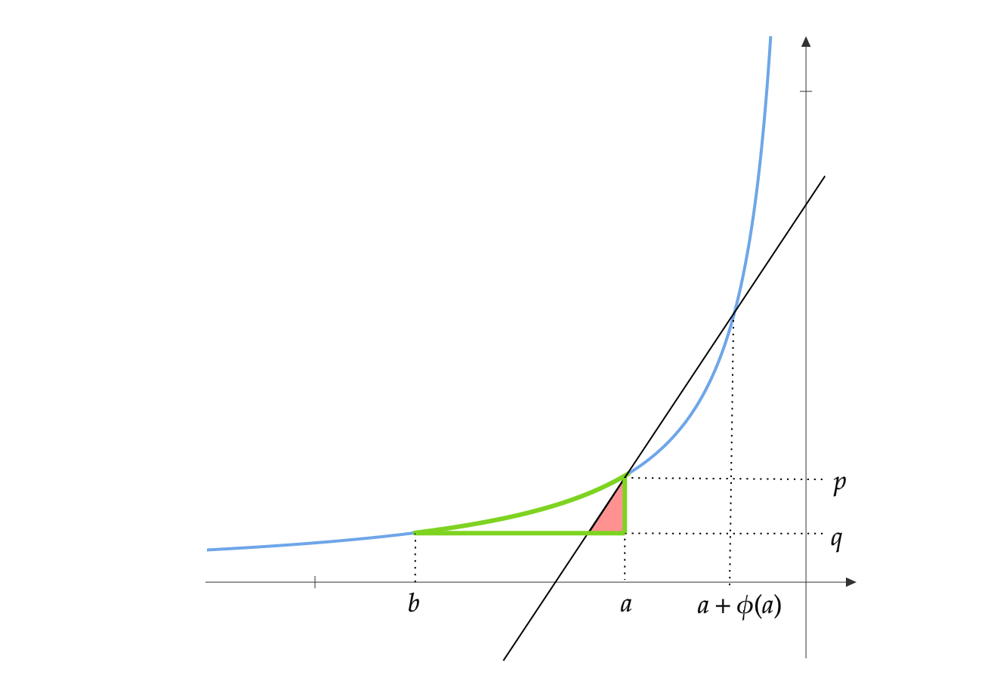

So far, we have shown how to get regret inequalities for OMD/FTRL where the second term is a sum, whose summands are of the form:

$$l^\top(x-y)-\frac{1}{\eta} \text{Breg}(y\|x)$$

Say we have a lower bound on the Bregman:

$$\text{Breg}(y\|x) \geq h_x(x-y)$$

Then, we can bound the term as:

$$
\begin{align*}
l^\top(x-y)-\frac{1}{\eta} \text{Breg}(y\|x) &\leq l^\top(x-y) - \frac{1}{\eta}h_x(x-y) \\
&\leq \frac{1}{\eta} \sup_{a \in \mathbb{R}^n} \left[\eta l^\top a - h_x(a)\right]\\
&= \frac{h_x^\star(\eta l)}{\eta}
\end{align*}
$$

The subscript $$x$$ in $$h_x$$ emphasizes that the lowerbound function may depend on $$x$$. The convex conjugate of $$h_x$$ is $$h_x^\star$$.

For example, if $$\psi = \exp$$, then $$f=x\log x-x$$ and $$\text{Breg}$$ will be the KL divergence. Then, we readily have a lowerbound through Pinsker's inequality:

$$KL(y\|x) \geq \frac{1}{2} \|y-x\|_1^2$$

This would imply a regret bound:

$$l^\top(x-y)-\frac{1}{\eta} KL(y\|x)\leq \frac{\eta}{2} \|l_t\|_\infty^2$$

For any potential $$\psi$$, if one can show a quadratic lowerbound:

$$\text{Breg}(y\|x) \geq \frac{1}{2}(x-y)^\top M(x)^{-1}(x-y)$$

This would imply a regret bound:

$$l^\top(x-y)-\frac{1}{\eta} \text{Breg}(y\|x)\leq \frac{1}{2\eta} (\eta l)^\top M(x)(\eta l) = \frac{\eta}{2} l^\top M(x)l$$

In the remaining post, I prove a neat theorem.

**Lemma**
Let $$p=\psi(a)$$ and $$q=\psi(b)$$. Let $$\phi$$ be a positive function such that $$b \leq a+\phi(a)$$ and define

$$m(a) = (\psi(a+\phi(a))-\psi(a))/\phi(a)$$

Then, we have the lowerbound:

$$\text{Breg}(q\|p) \geq \frac{1}{2} \frac{(p-q)^2}{m(\psi^{-1}(p))} $$

**Proof**

Using properties of potential functions, we know that:

$${f^\star}'(a) = \psi(a) \quad \text{ and } \quad \int_{\infty}^a \psi(x) dx = f^\star(a)$$

Using properties of conjugate duality and Bregman, we have:

$$
\begin{align*}
\text{Breg}(q\|p) &= \text{Breg}(\psi(b)\|\psi(a)) = \text{Breg}^\star(a\|b) = f^\star(a)-f^\star(b)- {f^\star}'(b)^\top(a-b)
\end{align*}
$$

We can visualize this quantity using potential functions.

Case1: $$a\geq b$$

Since $$f^\star(a)$$ is the integral of $$\psi$$, it is the area below the curve before $$a$$. Similarly $$f^\star(b)$$ is the area below the curve before $$b$$. The area of rectangle $$(b,a)\times(0,q)$$ is given by $${f^\star}'(b)(a-b) = q(b-a)$$.

So $$f^\star(a) - f^\star(b) - {f^\star}'(b)(a-b)$$ is the area with green borders.

Consider the line which intersects the curve at $$(a,p)$$ and $$(a+\phi(a),\psi(a+\phi(a)))$$. The slope of this line is

$$m(a) = \frac{\psi(a+\phi(a)) - \psi(a)}{\phi(a)}$$

Consider the red triangle in the figure. Its height is $$(p-q)$$. Using similar triangles, its base length is $$(p-q)/m(a)$$. So, the red triangle has area:

$$\frac{1}{2} \frac{(p-q)^2}{m(a)} = \frac{1}{2} \frac{(p-q)^2}{m(\psi^{-1}(p))}$$

Since this is clearly smaller than the area enclosed in green, we have:

$$\text{Breg}(q\|p) \geq \frac{1}{2} \frac{(p-q)^2}{m(\psi^{-1}(p))}$$

Case2: $$a\leq b \leq a+\phi(a)$$

We can repeat the same argument with the figure above. The area of the red triangle is smaller than the area enclosed in green. This gives:

$$\text{Breg}(q\|p) \geq \frac{1}{2} \frac{(p-q)^2}{m(\psi^{-1}(p))}$$

 Q.E.D 

**Theorem**

Let $$x = \psi(u)$$, $$y=\psi(v)$$. Then, we have the lowerbound:

$$\text{Breg}(y\|x) \geq \frac{1}{2} \sum_{i=1}^n \frac{(x_i-y_i)^2}{m(\psi^{-1}(x_i))}$$

This would imply a regret bound:

$$l^\top(x-y)-\frac{1}{\eta} \text{Breg}(y\|x)\leq  \frac{\eta}{2} \sum_{i=1}^n l_i^2 m(\psi^{-1}(x_i))$$

**Proof**

Using properties of conjugate duality and Bregman, we have:

$$
\begin{align*}
\text{Breg}(y\|x) &= \text{Breg}(\psi(v)\|\psi(u)) = \text{Breg}^\star(u\|v) = F^\star(u)-F^\star(v)-\nabla F^\star(v)^\top(u-v)\\
&= \sum_{i=1}^n f^\star(u_i) - f^\star(v_i) - {f^\star}'(v_i)(u_i-v_i) \geq \frac{1}{2} \sum_{i=1}^n \frac{(x_i-y_i)^2}{m(\psi^{-1}(x_i))}
\end{align*}
$$

The second statement is easy to verify from this point.

 Q.E.D 

**Corollary**

If $$y\leq x$$ then by we have the lowerbound:

$$\text{Breg}(y\|x) \geq \frac{1}{2} \sum_{i=1}^n \frac{(x_i-y_i)^2}{\psi'(\psi^{-1}(x_i))}=\frac{1}{2} \sum_{i=1}^n (x_i-y_i)^2 f''(x_i)$$

This would imply a regret bound:

$$l^\top(x-y)-\frac{1}{\eta} \text{Breg}(y\|x)\leq  \frac{\eta}{2} \sum_{i=1}^n \frac{l_i^2}{f''(x_i)} $$

**Proof**

Since $$y\leq x$$, we only have to invoke Case 1 from the lemma above. Applying the limit on  functions $$\phi(u) \to 0$$. We can see that $$m(u)\to \psi'(u)$$
